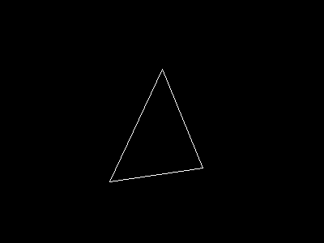

<div align="center">

# ShikaMath


  -FF69B4?style=flat-square)
  
  

> **A High-Performance,<br>SIMD-Accelerated C++ Math Library for 3D Graphics.**
<br>



<br>
*Figure 1: Software rendering output demonstrating a 3D triangle transformed by Model-View-Projection matrices calculated entirely by ShikaMath.*

</div>

## [日本語版はこちらへ](https://github.com/SHIKA-gfx/ShikaMath/blob/main/README.ja.md)

## 📖 Overview

**ShikaMath** is a custom-built, lightweight mathematics library designed from the ground up for real-time 3D rendering pipelines.

It was developed to gain a deep, foundational understanding of computer graphics mathematics—from raw vector arithmetic to complex camera transformations—prior to adopting modern graphics APIs like DirectX 12 or Vulkan. Written in Modern C++, ShikaMath focuses on maximizing performance through low-level intrinsic optimizations.

## ✨ Key Features

ShikaMath is not just a wrapper around standard math headers; it is engineered specifically for graphics performance.

## 🚀 SIMD Optimized Core
* Utilizes **SSE Intrinsics (`__m128`)** for parallelized floating-point operations.
* Achieves significant performance gains in vector addition, dot products, and matrix multiplications compared to scalar implementations.

## 💾 Hardware-Friendly Memory Layout
* Enforces **16-byte memory alignment** (`alignas(16)`) for `Vector3` and `Matrix4x4` structures.
* Ensures compatibility with SIMD registers and provides optimal data transfer layouts for future GPU vertex buffers.

## 📐 Comprehensive Linear Algebra
* **Vector3:** Complete implementation including Cross Product, Dot Product, Normalization, and operator overloads.
* **Matrix4x4:** Row-major storage optimized for SIMD broadcasting. Includes high-performance 4x4 matrix multiplication using row-linear combinations.

## 🎥 3D Transformation Pipeline
* Built-in support for fundamental transformations: **Translation**, **Rotation** (Euler angles), and **Scaling**.
* Implements a **Left-Handed Camera System** compatible with DirectX standards:
    * **View Matrix:** `LookAtLH`
    * **Projection Matrix:** `PerspectiveFovLH` (Z-depth 0.0 to 1.0)

## 🖼️ Visualization Tools
* Includes a lightweight `Canvas` class and a **PPM image exporter** for immediate visual verification of mathematical results.
* Implements basic software rasterization (Bresenham's line algorithm) for wireframe rendering validation.

---

## 🛠️ Tech Stack

* **Language** : Modern C++ (C++17 Standard)
* **Optimization** : SIMD Intrinsics (SSE/AVX Ready), 16-byte Alignment
* **Math Engine** : Custom Implemented Vector3 & Matrix4x4 (Row-Major)
* **Rendering** : CPU Software Rendering (Rasterization) 
* **Output Format** : PPM (Portable Pixel Map)
* **Build System** : CMake 3.10+ 
* **Dependencies** : **None** (Standard Template Library Only) 

## 📦 How to Build
This project uses **CMake** as its build system.

### Prerequisites
* C++17 compliant compiler (GCC, Clang, or MSVC)
* CMake 3.10 or higher

### Build Steps

```bash
# 1. Clone the repository
git clone https://github.com/your-username/ShikaMath.git
cd ShikaMath

# 2. Create build directory
mkdir build && cd build

# 3. Configure and build
cmake ..
make

```
---

## 🗺️ Roadmap

- [x] Core Vector/Matrix Math (SIMD)

- [x] Basic Camera System (View/Projection)

- [x] Software Wireframe Rendering (PPM Output)

- [ ] Barycentric Triangle Rasterization (Solid filling)

- [ ] Quaternion implementation for robust rotations

- [ ] Integration with DirectX 12 Rendering Pipeline

## 📄 License
This project is licensed under the **MIT License**.  
See the [LICENSE](LICENSE) file for details.